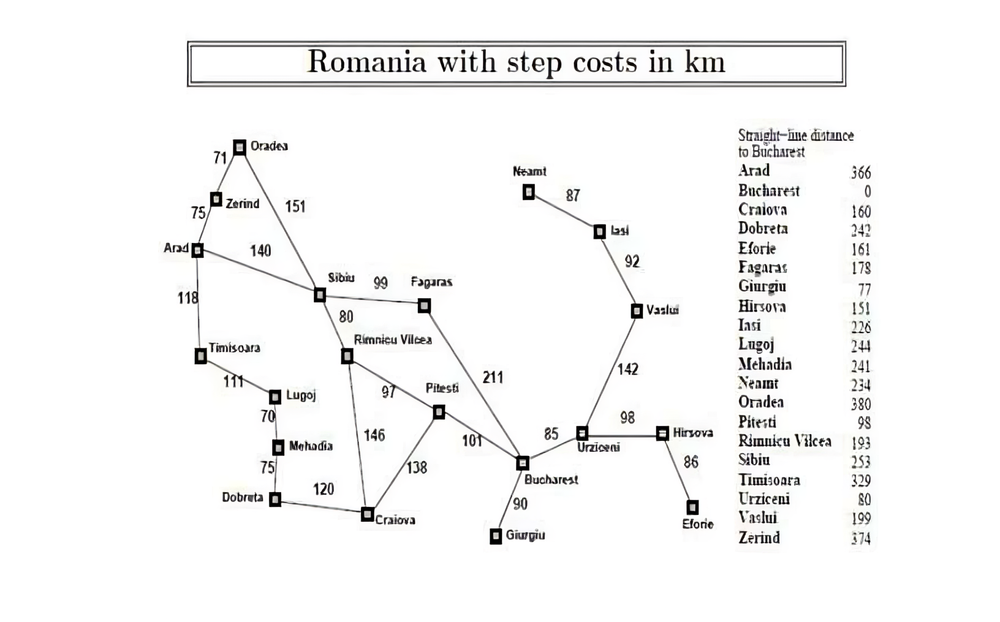

# 🗺️ A\* Pathfinding — Romania Road Map

> **Author:** [vamsi-31](https://github.com/vamsi-31)  
> A clean, heavily-commented implementation of the **A\* search algorithm** using the classic Romania road-map problem from *Artificial Intelligence: A Modern Approach* (Russell & Norvig).  
> Two variants included: **pure Python** (zero dependencies) and **Prolog-backed Python**.

[](https://www.python.org/)
[](https://www.swi-prolog.org/)
[](LICENSE)

---

## 📑 Table of Contents

1. [What is A\*?](#-what-is-a)
2. [Project Structure](#-project-structure)
3. [The Romania Map](#-the-romania-map)
4. [Quick Start](#-quick-start)
   - [Option A – Pure Python](#option-a--pure-python-no-dependencies)
   - [Option B – Prolog-backed Python](#option-b--prolog-backed-python)
5. [How to Add Your Own Cities & Roads](#-how-to-add-your-own-cities--roads)
6. [City Code Reference](#-city-code-reference)
7. [Understanding the Code](#-understanding-the-code)
8. [Example Runs](#-example-runs)
9. [Contributing](#-contributing)
10. [Fix Contributors / Rebase History](#-fix-contributors--rebase-history)
11. [License](#-license)

---

## 🤖 What is A\*?

A\* ("A-star") is a **best-first graph search algorithm** that finds the shortest path between two nodes. It is smarter than plain Dijkstra because it uses a **heuristic** — an educated guess about how far we still are from the goal — to focus the search in the right direction.

### The f = g + h formula

| Symbol | Meaning |
|--------|---------|
| **g(n)** | Actual cost of the best path found so far from **start → n** |
| **h(n)** | Heuristic estimate of remaining cost from **n → goal** |
| **f(n)** | Estimated total cost through n: `f = g + h` |

At every step A\* expands the frontier node with the **lowest f-score**.  
As long as `h(n)` never *overestimates* the true remaining cost (**admissibility**), A\* is guaranteed to find the optimal path. ✅

In this project `h(n)` = straight-line distance from city `n` to Bucharest, which always ≤ actual road distance.

---

## 📁 Project Structure

```
AStar_Algorithm/
│
├── Map.png               # Romania road-map reference image
├── knowledge_base.pl     # Prolog facts: cities, roads, heuristics
├── A_Star_Prolog.py      # A* reading data from Prolog (needs pyswip + SWI-Prolog)
├── A_Star_Python.py      # A* in pure Python — no extra dependencies
├── requirements.txt      # Python dependencies (pyswip only)
└── README.md             # This file
```

---

## 🗺️ The Romania Map



The table on the right side of the map lists each city's **straight-line distance to Bucharest** — those are the heuristic (`h`) values used by A\*.

---

## 🚀 Quick Start

### Option A – Pure Python (no dependencies)

Works out of the box with Python 3.10+. No installs needed.

```bash
# Clone the repo
git clone https://github.com/vamsi-31/AStar_Algorithm.git
cd AStar_Algorithm

# Run
python A_Star_Python.py
```

Sample session:

```
Enter source city code      : a
Enter destination city code : b
Show step-by-step expansion? [y/N]: y
```

---

### Option B – Prolog-backed Python

This version stores the graph data in `knowledge_base.pl` and loads it at runtime via **pyswip** — a Python ↔ SWI-Prolog bridge. Great for understanding how knowledge-base systems work alongside conventional code.

#### Step 1 — Install SWI-Prolog

| OS | Instructions |
|----|-------------|
| **Windows** | Download from [swi-prolog.org/download/stable](https://www.swi-prolog.org/download/stable) and run the installer. Make sure `swipl` is added to your `PATH`. |
| **Ubuntu / Debian** | `sudo apt install swi-prolog` |
| **macOS** | `brew install swi-prolog` |

Verify: `swipl --version` should print a version number.

#### Step 2 — Install pyswip

```bash
pip install pyswip
# or use the requirements file:
pip install -r requirements.txt
```

#### Step 3 — Run

```bash
python A_Star_Prolog.py
```

> **Common errors**
> | Error | Fix |
> |-------|-----|
> | `OSError: SWI-Prolog not found` | Add `swipl` to your system `PATH` and restart your terminal |
> | `FileNotFoundError: knowledge_base.pl` | Run the script from inside the `AStar_Algorithm/` folder |
> | `ImportError: No module named 'pyswip'` | Run `pip install pyswip` |

---

## ➕ How to Add Your Own Cities & Roads

### In `A_Star_Python.py`

Find the `CITY_NAMES`, `HEURISTIC`, and `ROADS` dictionaries near the top of the file.

**Step 1 — Add city name and heuristic:**

```python
CITY_NAMES["x"] = "Xville"
HEURISTIC["x"]  = 200   # straight-line km to Bucharest (estimate or look up on a map)
```

**Step 2 — Add roads (both directions — the graph is undirected):**

```python
ROADS["x"] = [("s", 50), ("r", 80)]  # Xville → Sibiu 50 km, → Rimnicu 80 km
ROADS["s"].append(("x", 50))          # Sibiu → Xville
ROADS["r"].append(("x", 80))          # Rimnicu → Xville
```

Run `python A_Star_Python.py` — your city appears immediately. ✅

---

### In `knowledge_base.pl` (for the Prolog version)

**Step 1 — Heuristic fact:**

```prolog
hs(x, 200).   % Xville — 200 km straight-line to Bucharest
```

**Step 2 — Road facts (both directions):**

```prolog
edges(x, s, 50).   edges(s, x, 50).   % Xville ↔ Sibiu  50 km
edges(x, r, 80).   edges(r, x, 80).   % Xville ↔ Rimnicu 80 km
```

No Python changes needed — `A_Star_Prolog.py` reads the `.pl` file automatically. ✅

---

## 📖 City Code Reference

| Code | City | h (km to Bucharest) |
|:----:|------|----:|
| `a` | Arad | 366 |
| `b` | **Bucharest** *(goal)* | **0** |
| `c` | Craiova | 160 |
| `d` | Dobreta | 242 |
| `e` | Eforie | 161 |
| `f` | Fagaras | 178 |
| `g` | Giurgiu | 77 |
| `h` | Hirsova | 151 |
| `i` | Iasi | 226 |
| `l` | Lugoj | 244 |
| `m` | Mehadia | 241 |
| `n` | Neamt | 234 |
| `o` | Oradea | 380 |
| `p` | Pitesti | 98 |
| `r` | Rimnicu Vilcea | 193 |
| `s` | Sibiu | 253 |
| `t` | Timisoara | 329 |
| `u` | Urziceni | 80 |
| `v` | Vaslui | 199 |
| `z` | Zerind | 374 |

---

## 🧠 Understanding the Code

### Core A\* loop (annotated)

```python
open_set  = {start}   # Discovered cities not yet fully explored
closed_set = set()    # Cities we have fully explored (all neighbours checked)

g      = {start: 0}       # g(n): cheapest known path cost from start → n
parent = {start: start}   # For reconstructing the path at the end

while open_set:
    # 1. Pick the open city with the lowest f = g + h
    current = min(open_set, key=lambda n: g[n] + h(n))

    # 2. Reached the goal? Retrace parent pointers to get the full path
    if current == goal:
        return reconstruct_path(parent, start, goal)

    # 3. Move current from open → closed (we've now fully explored it)
    open_set.discard(current)
    closed_set.add(current)

    # 4. Relax edges to all neighbours
    for neighbor, road_cost in neighbors(current):
        if neighbor in closed_set:
            continue                          # already explored, skip

        new_g = g[current] + road_cost
        if new_g < g.get(neighbor, infinity): # found a cheaper route to neighbor
            g[neighbor]      = new_g
            parent[neighbor] = current
            open_set.add(neighbor)            # (re-)add to frontier
```

### Why two implementations?

| Feature | `A_Star_Python.py` | `A_Star_Prolog.py` |
|---------|:-----------------:|:-----------------:|
| Zero extra installs | ✅ | ❌ (needs SWI-Prolog + pyswip) |
| Graph data separate from code | ❌ | ✅ (edit `.pl` only) |
| Best for learning A\* | ✅ | ✅ |
| Best for learning Prolog-Python interop | ❌ | ✅ |
| Verbose step-by-step tracing | ✅ | ✅ |

---

## 💻 Example Runs

### Arad → Bucharest (the classic textbook example)

```
Enter source city code      : a
Enter destination city code : b

✔  Path   : Arad → Sibiu → Rimnicu Vilcea → Pitesti → Bucharest
   Codes  : a → s → r → p → b
   Cost   : 418 km
```

### Neamt → Eforie

```
Enter source city code      : n
Enter destination city code : e

✔  Path   : Neamt → Iasi → Vaslui → Urziceni → Hirsova → Eforie
   Codes  : n → i → v → u → h → e
   Cost   : 535 km
```

### With verbose step tracing (`y` at the prompt)

```
[A*] Searching  Arad → Bucharest
--------------------------------------------
  Expanding : Arad                  g=   0  h= 366  f= 366
  Expanding : Sibiu                 g= 140  h= 253  f= 393
  Expanding : Rimnicu Vilcea        g= 220  h= 193  f= 413
  Expanding : Fagaras               g= 239  h= 178  f= 417
  Expanding : Pitesti               g= 317  h=  98  f= 415
  Expanding : Bucharest             g= 418  h=   0  f= 418
```

---

## 🤝 Contributing

Pull requests are welcome! Some ideas if you want to extend the project:

- 📐 Animate the step-by-step node expansion visually (pygame / matplotlib)
- 🔄 Add Dijkstra and BFS alongside A\* so students can compare all three
- 🌍 Swap in a different map (India, Europe, your city's road network)
- ⚡ Replace the `min()` scan with a `heapq` priority queue for O(log n) performance
- 🧪 Add unit tests (`pytest`) for the pathfinding logic

**How to contribute:**

```bash
git clone https://github.com/vamsi-31/AStar_Algorithm.git
cd AStar_Algorithm
git checkout -b feature/your-feature-name
# make your changes
git push origin feature/your-feature-name
# open a Pull Request on GitHub
```

## 📄 License

MIT License — see [LICENSE](LICENSE) for details.  
Map data and heuristics from *Artificial Intelligence: A Modern Approach* by Russell & Norvig (3rd / 4th ed.).